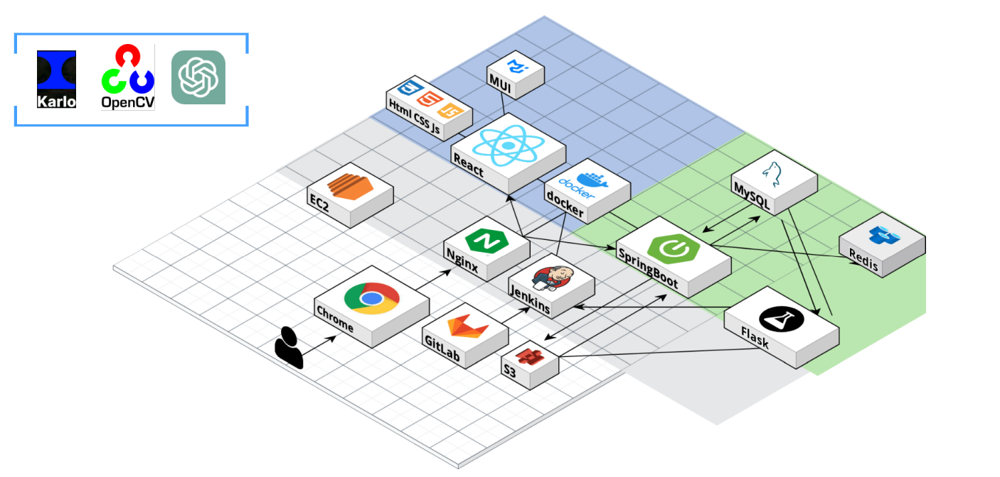
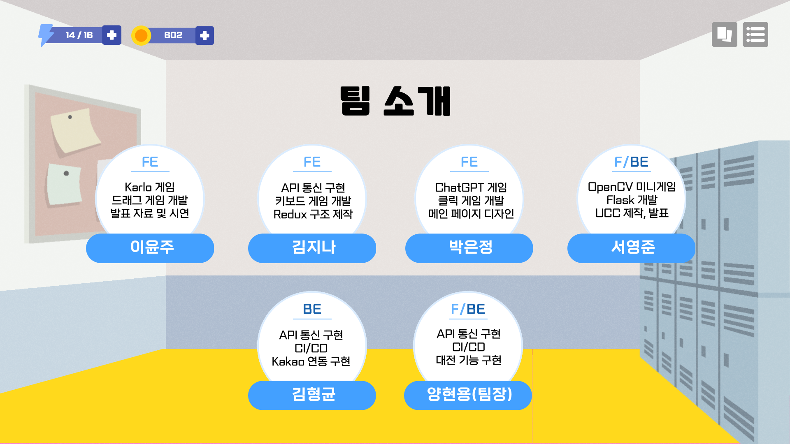
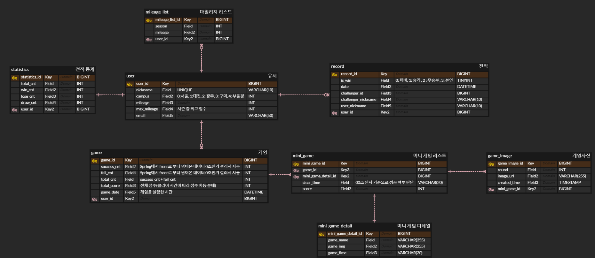
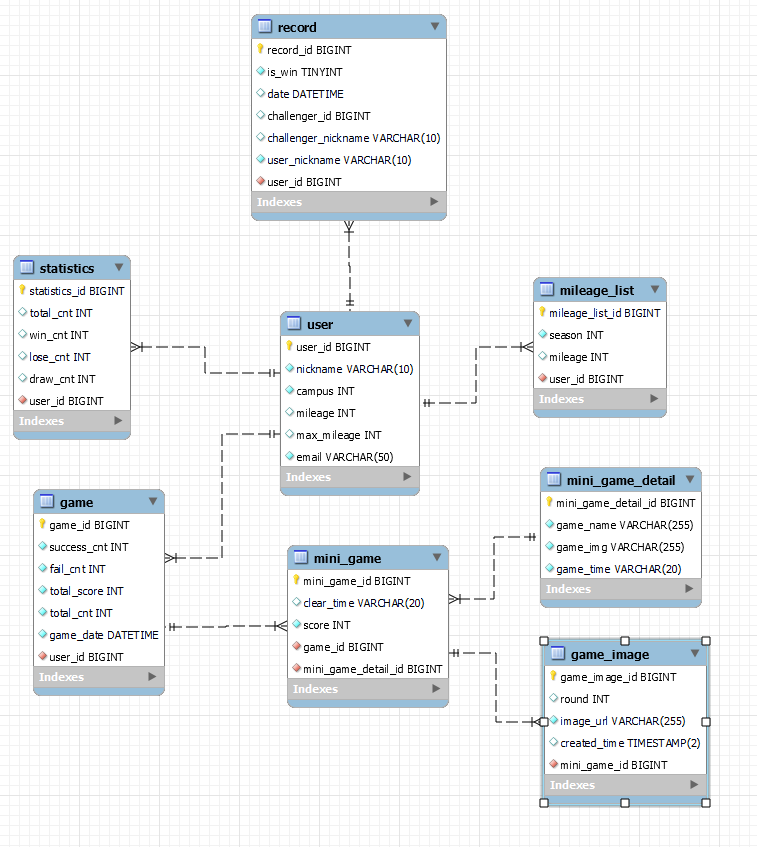

# SSAvival(싸바이벌)

## SSAFY 교육생들의 일과를 테마로 한 미니 게임 웹 서비스

### 소개 UCC

[https://www.youtube.com/watch?v=JP4EiAR5pdE](https://www.youtube.com/watch?v=JP4EiAR5pdE)

### 개발 환경

[Front-end]

- 사용 스택 : React, Redux, JavaScript, MUI, Styled-Component
- IDE : VS code

[Back-end]

- 사용 스택 : SpringBoot, Spring Data JPA, Flask, Java, Python, Spring Security, MySQL, Redis
- IDE : IntelliJ, VS code

[Infra]

- 서버 : AWS EC2, ubuntu, S3, Docker, Docker-compose, Jenkins, SSL/TLS, Nginx, GitLab, Jira

### 서비스 주요 기능 :

- 싱글 플레이
  - [**Karlo API**](https://kakaobrain.com/techplayground/karlo/demo)를 활용하여 퍼즐 게임 이미지 자동 생성 기능 구현
  - [**ChatGPT API**](https://openai.com/blog/introducing-chatgpt-and-whisper-apis)를 이용하여 연상 게임 정답 단어 1개, 관련 단어 5개를 추출하는 기능 구현
  - [**OpenCV**](https://opencv.org/)의 `cv2.xphoto.inpaint` 메서드를 사용하여 틀린 그림 찾기 게임의 틀린 그림 제작 기능 구현
  - [**react-beautiful-dnd**](https://github.com/atlassian/react-beautiful-dnd) 라이브러리를 활용하여 드래그&드롭 게임의 트래킹 기능 구현
- 가상 대전
  - [**html2canvas**](https://html2canvas.hertzen.com/documentation) 를 사용하여 싱글 플레이 시 매 게임 진행 시간 동안 0.5초 간격으로 게임 컴포넌트 캡쳐, 저장
  - 멀티 플레이 시, 저장된 화면을 상대 화면으로 출력하는 방식으로 가상 대전 기능 구현
  - [**Kakao API**](https://developers.kakao.com/) 로그인 및 친구에게 게임 결과 메시징 기능 구현

### 개발기간 : 2023.04.10 ~ 2023.05.19 (총 6주)

### 역할 및 인원 : 총 6명(FE - 4명, BE - 2명)

## 서비스 소개 및 특장점

- **소개**
  - SSAFY 교육생의 일상을 테마로 만든 12가지 미니게임으로 점심시간, 자투리 시간에 친구와 함께 즐길 수 있는 오락 서비스
- **특장점**
  1. 가상 대전
     - 동시 접속 없이 녹화된 상대방의 게임 진행 기록을 보며 경쟁하는 가상 대전 구현
  2. 매번 바뀌는 정답
     - Karlo, Open CV, ChatGPT API를 활용하여 게임마다 정답이 바뀌도록 구현
  3. 친선 대전
     - 대전하고 싶은 유저 검색 기능 및 대전 결과를 카카오톡 공유하기 API를 활용하여 상대 유저에게 전달하여 친선 대전
  4. 캠퍼스 경쟁
     - 캠퍼스 별 평균 점수를 겨루며 게임 집중도를 높이고 친목과 단합력을 기를 수 있음

## DB&API 설계서

### Rest API

### ERD

### EER

## 화면 기획서

### 기능 명세서

### 화면 설명

- **로그인 화면**
  
- **회원가입 화면**
  - 카카오 로그인 후, 닉네임과 지역 설정
    
- **메인 화면**
  - 내 전적 및 티어, 마일리지 확인
  - 싱글/멀티 플레이 입장 버튼
  - 캠퍼스 랭킹 / 캠퍼스 별 유저 랭킹
    
- **게임 시작 화면**
  - 10초 \* 12개의 미니게임
    
- **싱글 플레이 게임 화면**

  - 각 게임 별 이겼을 시 클리어 시간에 비례한 점수 부여

  1. Git bash 게임

     

  1. 자소서 게임

     

  1. 연상 게임

     

  1. MatterMost 게임

     

  1. 자리 잡기 게임

     

  1. 퇴실 클릭 게임

     

  1. 사물함 게임

     

  1. IP주소 게임

     

  1. 휴지 뽑기 게임

     

  1. 명찰 게임

     

  1. 퍼즐 게임

     

  1. 틀린 그림 찾기 게임

     

- **가상 대전 화면**

  1. 대전 상대 검색

     

  1. 카톡 공유 기능

     

  1. 가상 대전 모습

     
